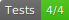

# Mocha Badge Generator


[](https://travis-ci.com/ianpogi5/mocha-badge-generator)
[](https://codecov.io/gh/ianpogi5/mocha-badge-generator)
[](https://github.com/ianpogi5/mocha-badge-generator/issues)

[](https://www.npmjs.com/package/mocha-badge-generator)

Mocha Badge Generator is a [Mocha](https://mochajs.org/) reporter which outputs a badge (SVG file) with the number of tests passed and failed which you can embed in your readme file.

## Install

```bash
npm install mocha-badge-generator --save-dev
```

## Usage

```bash
mocha --reporter mocha-badge-generator
```

Default out file is `test/badge.svg`.

## Configuration

```bash
export MOCHA_BADGE_GEN_SUBJECT=Tests
export MOCHA_BADGE_GEN_OK_COLOR=brightgreen
export MOCHA_BADGE_GEN_KO_COLOR=red
export MOCHA_BADGE_GEN_OUTPUT='./test/badge.svg'
export MOCHA_BADGE_GEN_FORMAT=svg
```
