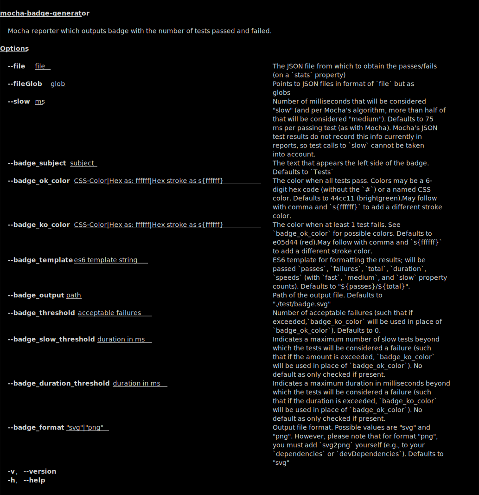

# Mocha Badge Generator


[](https://travis-ci.com/ianpogi5/mocha-badge-generator)
[](https://codecov.io/gh/ianpogi5/mocha-badge-generator)
[](https://github.com/ianpogi5/mocha-badge-generator/issues)

[](https://www.npmjs.com/package/mocha-badge-generator)

No need for 3rd party to generate badge for your tests. You can generate it locally by running your test script.

Mocha Badge Generator is a [Mocha](https://mochajs.org/) reporter which outputs a badge (SVG or PNG file) with the number of tests passed and failed which you can embed in your readme file.

## Install

```bash
npm install mocha-badge-generator --save-dev
```

## Usage

In your `package.json`, add reporter to your test script.

```json
{
    "scripts": {
        "test": "mocha --reporter mocha-badge-generator",
    }
}
```

Default output file is `test/badge.svg`.

## Configuration

You can change the output by defining Mocha `--reporter-options` or environment variables in your test script.

| `--reporter-option` | Env variable | Default  | Description |
|---------------------|--------------| :------: |-------------|
| badge_subject | MOCHA_BADGE_GEN_SUBJECT  | Tests | The text that appears the left side of the badge. |
| badge_ok_color | MOCHA_BADGE_GEN_OK_COLOR | 44cc11 (brightgreen) | The color when all tests pass. Colors may be a 6-digit hex code or a named CSS color. If upgrading from <= 0.3.0, please note that if you were not relying on the default colors, the CSS named colors may differ from the [`badge-up` builtin colors](https://github.com/yahoo/badge-up/blob/b6f073624fee0d5ee5341a90a9cfb9ff6ae52034/index.js#L51-L64) we were using previously; use the corresponding hex code (without the `#`), and convert to 6 digits (e.g., `4C1` to `44CC11`). May now also be followed by a comma and `s{ffffff}` to add a different stroke color. |
| badge_ko_color | MOCHA_BADGE_GEN_KO_COLOR | e05d44 (red) | The color when at least 1 test fail. See above for possible colors (and a note about upgrading from <= 0.3.0). |
| badge_output | MOCHA_BADGE_GEN_OUTPUT | ./test/badge.svg | Path of the output file. |
| badge_format | MOCHA_BADGE_GEN_FORMAT | svg | Output file format. Possible values are "svg" and "png". However, please note that for format "png", while versions <= 0.3.0 bundled `svg2png`, you must now add `svg2png` yourself (e.g., to your `dependencies` or `devDependencies`).  |
| badge_template | MOCHA_BADGE_GEN_TEMPLATE | `"${passes}/${total}"` | ES6 template for formatting the results; will be passed `passes`, `failures`, `total`, `duration`, `speeds` (with `fast`, `medium`, and `slow` property counts). |

Sample config for changing output to PNG.

```json
{
    "scripts": {
        "test": "mocha --reporter mocha-badge-generator --reporter-options=badge_format=png,badge_output=badge.png",
    }
}
```

Alternatively, you may use environmental variables:

```json
{
    "scripts": {
        "test": "MOCHA_BADGE_GEN_FORMAT=png MOCHA_BADGE_GEN_OUTPUT=badge.png mocha --reporter mocha-badge-generator",
    }
}
```

## Adding to your README

```markdown

```

 If you want the badge to show in npm, use the following format.

```markdown

```

Change `ianpogi5/mocha-badge-generator` to your own github repo.

## Other methods

While the main method may be sufficient, certain environments (such as Cypress)
may call for creating a badge based on already-generated JSON test file results
(e.g., when merging multiple test results into a single file).

### `makeBadge`

```js
const {makeBadge} = require('mocha-badge-generator/makeBadge');
makeBadge({
    // REQUIRED
    passes,
    failures,
    // OPTIONAL
    options: {
        // See above for expected values
        badge_subject,
        badge_ok_color,
        badge_ok_color,
        badge_output,
        badge_format,
        badge_template
    }
});
```

### `makeBadgeFromJSONFile`

You can make a badge out of a Mocha JSON reporter report (as a JSON file).

```js
const {makeBadgeFromJSONFile} = require('mocha-badge-generator/makeBadge');
makeBadgeFromJSONFile({
    // REQUIRED
    // This JSON file expects the structure: `{stats: {passes, failures}}`
    file: '/path/to/JSON/file'
    // Options
    // Milliseconds which will be considered "slow" (and by Mocha's algorithm,
    //  any more than half of this will still be considered "medium"); this
    //  is not available in test reports even when individual tests add
    //  their own calls to `slow`, so reporting on `speeds` may only be
    //  useful if your tests have no idiosyncratic speed expectations.
    //  When using `makeBadge` (i.e., using with Mocha while it is running),
    //  however, there is no such limitation, and no need to specify `slow`
    //  as an option to `makeBadge` (just supply it as usual to Mocha).
    slow: 75,
    // See above for expected values
    badge_subject,
    badge_ok_color,
    badge_ok_color,
    badge_output,
    badge_format,
    badge_template
});
```

## CLI

The `makeBadgeFromJSONFile` functionality is exposed from the command line:


